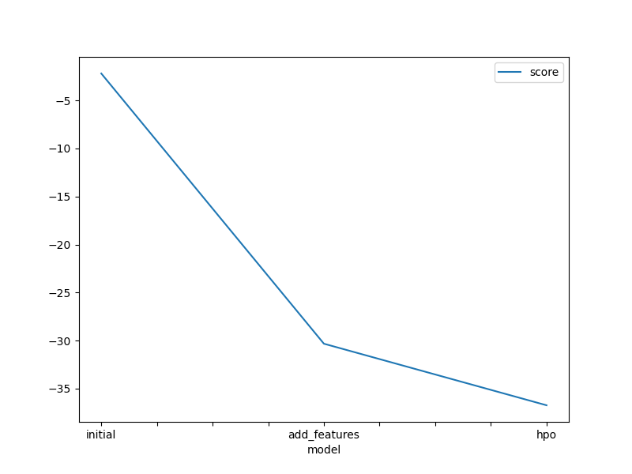
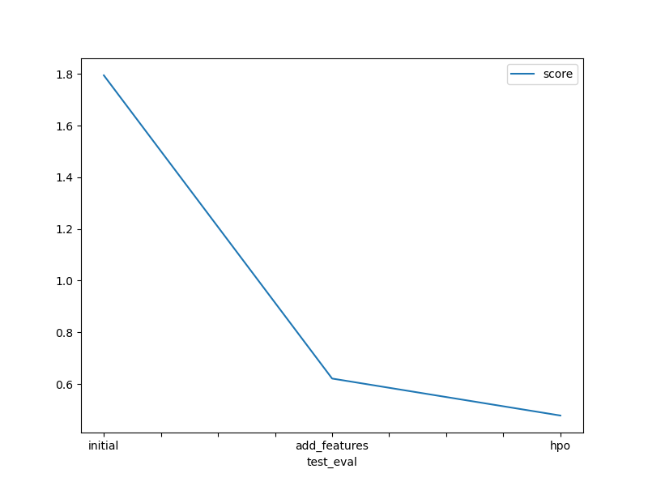

# Report: Predict Bike Sharing Demand with AutoGluon Solution
#### JORGE LUIS CHACON ASCENCIO

## Initial Training
### What did you realize when you tried to submit your predictions? What changes were needed to the output of the predictor to submit your results?
ANSWER: The first thing I realized was that if I attempted to use the test dataset for predicting, initially I just didnt remove the columns 'casual' and 'registered', and were included the first time i did the fit/training, these columns are not present in the test data, so when trying to predict there was an error because these columns were not present. So i tried again but this time removing those columns, after doing this, the predict call worked fine.
second thing, there is a submission dataframe with two columns, that is the format expected by kaggle to score the results.

### What was the top ranked model that performed?
ANSWER: In all cases, the top ranked model was : WeightedEnsemble_L3   

## Exploratory data analysis and feature creation
### What did the exploratory analysis find and how did you add additional features?
ANSWER: 1st thing i noticed was that the data was very clean, there were no missing values.
the min value of count was 1, the max value was 977, the mean is 191.57.
Besides the weather and season, probably we could have taken the columns 'holiday' and 'workingday' as category datatype.
Then for the additional features, i just took the datetime column and extracted the year, month, day and hour into separate columns/features.
then also changed the datatype of season and weather to category datatype.

### How much better did your model preform after adding additional features and why do you think that is?
ANSWER: just by adding the additional features the model improved significantly from almost 1.79 to 0.62, the difference of 1.17 gives a 65% improvement of the score.
Giving more information to the training gives more data to create a better prediction, it is easier to find a pattern in data of for same day number or same hour instead of using only the datetimecolumn.
Maybe if the dataset is bigger, for example with data of multiple years, a training would be able to find patterns on same dates of different years, even like this I think it would be beneficial to have the date split in separate columns for year, month, day, hour, etc.

## Hyper parameter tuning
### How much better did your model preform after trying different hyper parameters?
ANSWER: 
After tuning hyper parameters improved from 0.62 to 0.47, that is a 0.15 improvement (24% improvement).

### If you were given more time with this dataset, where do you think you would spend more time?
ANSWER: 
Two places: 
1. expanding a bit more the EDA to find some additional insight that could improve the training.
2. trying just a few more scenarios of different hyper parameter tuning.

### Create a table with the models you ran, the hyperparameters modified, and the kaggle score.
|model|hpo1|hpo2|hpo3|score|
|--|--|--|--|--|
|initial|?|?|?|?|
|add_features|?|?|?|?|
|hpo|?|?|?|?|

pd.DataFrame({
    "model": ["initial", "add_features", "hpo"],
    "hpo1": [-2.193532, -2.193532, -2.815309],
    "hpo2": [-30.323445, -30.549232, -31.106089],
    "hpo3": [-36.732682, -36.891848, -37.059847],
    "score": [1.79485, 0.62099, 0.47778]
})

### Create a line plot showing the top model score for the three (or more) training runs during the project.

ANSWER: yes, please refer to the report part in project-template.ipynb (or html exported version of it)

### Create a line plot showing the top kaggle score for the three (or more) prediction submissions during the project.

ANSWER: yes, please refer to the report part in project-template.ipynb (or html exported version of it)

## Summary
ANSWER: the autogluon is a powerful tool that can help build a model for making preditions on a dataset.
sufficient time should be given to data analysis part, so that the training is accurate, checking on datetime columns would help improve significantly.
for additional performance boost, stacking and bagging and some manual tuning of hyper parameters can also be applied, do notice that the extra boost will cause to consume additional hardware resources.
